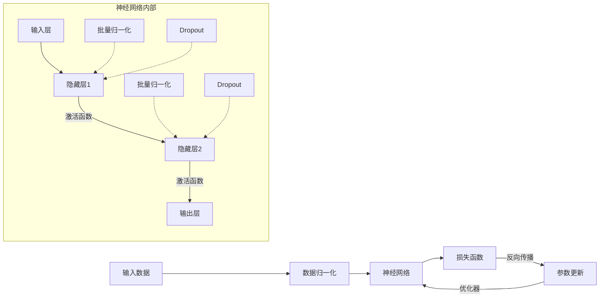
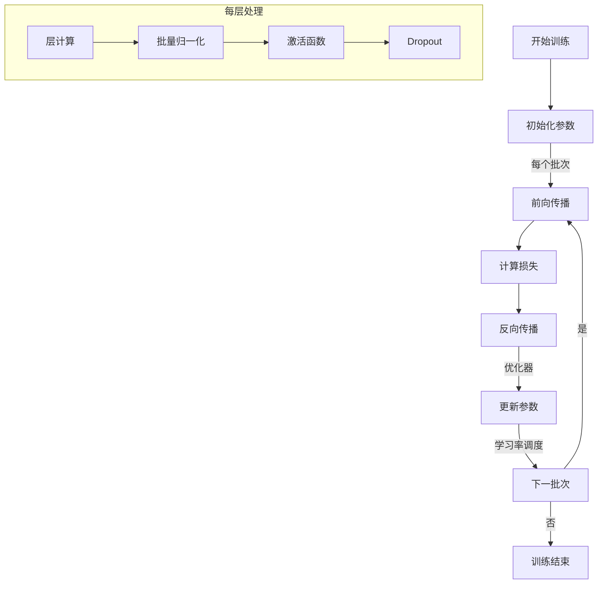
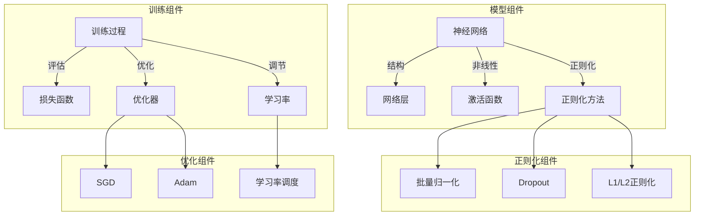
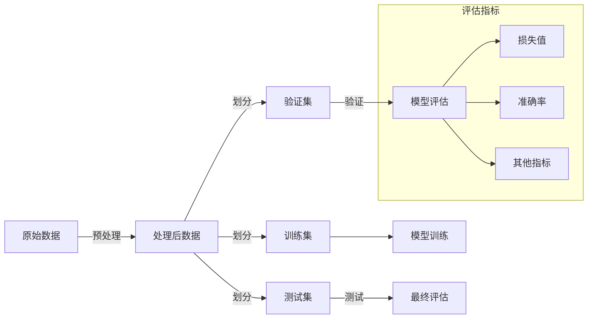
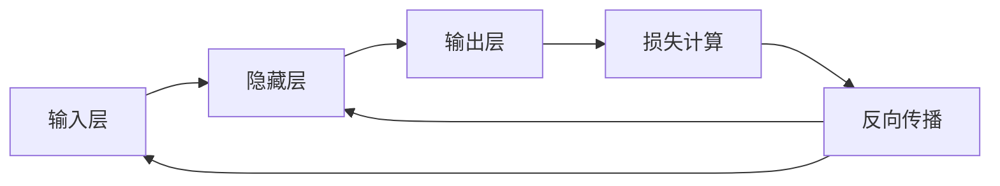

# PyTorch 深度学习完全指南

## 目录
- [深度学习概念的通俗解释](#深度学习概念的通俗解释)
- [PyTorch核心API](#pytorch核心api)
- [深度学习基础概念](#深度学习基础概念)
- [常见模型架构](#常见模型架构)
- [实践建议](#实践建议)
- [实际应用场景](#实际应用场景)
- [性能优化指南](#性能优化指南)

## 深度学习概念的通俗解释

### 神经网络是什么？

想象一个神经网络就像是一个复杂的"多层过滤系统"：

- **输入层**：就像是一个接收原材料的工厂入口
- **隐藏层**：像是工厂中的多道加工工序，每道工序都对材料进行特定的处理
- **输出层**：最终产品出口，提供加工后的结果

### 前向传播与反向传播

**前向传播**就像是食谱的执行过程：
- 你按照食谱的步骤（网络层）一步步处理食材（数据）
- 每一步都会改变食材的状态（特征转换）
- 最终得到一道菜（预测结果）

**反向传播**就像是改进食谱：
- 尝了一口菜后发现味道不对（计算损失）
- 回想每一步的操作，思考哪里需要调整（计算梯度）
- 修改食谱中的各个步骤（更新参数）
- 下次做菜时使用改进后的食谱（下一轮训练）

### 损失函数

损失函数就像是"评分卡"：
- **均方误差(MSE)**：就像测量射箭时箭与靶心的距离，距离越远，分数越低
- **交叉熵**：就像是评判你猜测的概率与实际情况的接近程度，猜错越离谱，扣分越多

### 激活函数

激活函数就像是"决策者"：
- **ReLU**：就像是一个门卫，只让正面信息通过，负面信息一律挡在门外（小于0的值变为0）
- **Sigmoid**：就像是将意见压缩到0-1之间的评分，非黑即白的二分决策
- **Tanh**：类似于Sigmoid，但允许表达负面评价（-1到1之间）

### 批量归一化

批量归一化就像是"标准化考试分数"：
- 原始分数可能分布不均（有的科目平均60分，有的科目平均90分）
- 通过归一化，将所有科目的分数调整到相似的分布（均值为0，方差为1）
- 这样不同科目的分数就可以公平比较了

### Dropout

Dropout就像是"团队协作中的独立思考训练"：
- 在训练时随机让一些团队成员"休假"（丢弃一些神经元）
- 迫使其他成员学会独立完成任务（减少依赖）
- 最终形成一个更强大、更可靠的团队（更鲁棒的模型）

### 优化器

优化器就像是不同风格的"登山向导"：
- **SGD**：稳健型向导，按照坡度一步步前进，但可能走得较慢
- **Adam**：聪明型向导，会根据路况调整步伐大小，并记住之前的路径经验

### 学习率

学习率就像是"步伐大小"：
- 太大：可能一步跨过山顶，永远找不到最高点
- 太小：进展太慢，可能需要很长时间才能到达山顶
- 学习率调度：就像是随着接近山顶，逐渐缩小步伐以便更精确地找到最高点

### 过拟合与欠拟合

- **过拟合**：就像是死记硬背考试答案，而不是理解概念。在见过的题目上表现完美，但遇到新题型就束手无策。
- **欠拟合**：就像是只学了最基础的概念，连已知的题目都做不好。

### 正则化

正则化就像是"自我约束"：
- **L1正则化**：鼓励精简行李（模型参数），只带最必要的东西
- **L2正则化**：鼓励均衡分配重量，不让任何一件行李过重（限制大权重）

### 卷积神经网络

卷积神经网络就像是"图像检查员"：
- **卷积层**：就像是用不同的放大镜检查图像的不同特征（边缘、纹理、形状等）
- **池化层**：就像是总结每个区域的关键信息，忽略细节
- **全连接层**：就像是根据所有收集到的特征做出最终决策

### 循环神经网络

循环神经网络就像是"带记忆的阅读者"：
- 一边阅读文本（处理序列数据）
- 一边记住之前读过的内容（维护隐藏状态）
- 根据当前内容和记忆做出判断（生成输出）

### 深度学习组件关系图

#### 1. 数据流视角



#### 2. 训练过程视角



#### 3. 组件功能视角



#### 4. 数据处理与模型评估关系



这些图表展示了深度学习中各组件之间的关系：

1. **数据流视角**展示了数据如何在网络中流动，以及各个组件如何处理数据
2. **训练过程视角**展示了模型训练的完整循环，包括前向传播、损失计算、反向传播和参数更新
3. **组件功能视角**展示了不同组件的层次关系和功能分类
4. **数据处理与模型评估关系**展示了从数据准备到模型评估的完整流程

这些关系图帮助我们理解：
- 各组件如何协同工作
- 训练过程中的数据流向
- 不同组件的功能分类
- 模型训练和评估的完整流程

这些通俗的解释和可视化图表希望能帮助你建立对深度学习概念的直观理解，为后面更技术性的内容打下基础。

## PyTorch核心API

### 1. 张量操作 (Tensor Operations)
```python
# 创建张量
torch.tensor()     # 从数据创建张量
torch.zeros()      # 创建全0张量
torch.ones()       # 创建全1张量
torch.randn()      # 创建随机正态分布张量
```

主要操作：
- `view()/reshape()`: 改变张量形状
- `squeeze()/unsqueeze()`: 压缩/扩展维度
- `cat()/stack()`: 张量拼接
- `mean()/sum()`: 统计运算

### 2. 自动求导 (Autograd)
```python
x = torch.tensor([1.0], requires_grad=True)
y = x * 2
y.backward()  # 自动计算梯度
x.grad        # 获取梯度值
```

关键概念：
- `requires_grad`: 标记需要计算梯度的张量
- `backward()`: 反向传播计算梯度
- `grad`: 存储梯度值
- `no_grad()`: 临时关闭梯度计算

### 3. 神经网络模块 (nn.Module)
```python
class Net(nn.Module):
    def __init__(self):
        super().__init__()
        self.fc1 = nn.Linear(784, 128)
        self.fc2 = nn.Linear(128, 10)
    
    def forward(self, x):
        x = F.relu(self.fc1(x))
        return self.fc2(x)
```

常用层：
- `nn.Linear`: 全连接层
- `nn.Conv2d`: 2D卷积层
- `nn.RNN/LSTM/GRU`: 循环神经网络层
- `nn.BatchNorm2d`: 批量归一化
- `nn.Dropout`: Dropout正则化

### 4. 优化器 (Optimizers)
```python
optimizer = optim.SGD(model.parameters(), lr=0.01)
optimizer.zero_grad()  # 清零梯度
loss.backward()        # 反向传播
optimizer.step()       # 更新参数
```

常用优化器：
- `optim.SGD`: 随机梯度下降
- `optim.Adam`: 自适应矩估计
- `optim.RMSprop`: 均方根传播
- `optim.AdamW`: 带权重衰减的Adam

## 深度学习基础概念

### 1. 前向传播与反向传播



- **前向传播**：数据从输入层经过网络层层传递到输出层的过程
  - **作用**：将输入数据转换为预测输出
  - **解决问题**：实现从原始数据到目标输出的复杂非线性映射
  - **工作原理**：每一层接收上一层的输出，应用权重和激活函数，产生新的输出

- **反向传播**：从输出层计算损失，然后逐层计算梯度并更新参数的过程
  - **作用**：优化网络参数，使模型预测更准确
  - **解决问题**：
    - 解决了深层网络参数优化的难题
    - 使得深度学习模型能够自动学习特征表示
  - **核心思想**：链式法则计算梯度，从后向前传递误差信号

### 2. 损失函数
常见损失函数及其应用场景：

- **均方误差(MSE)**：回归问题
  ```python
  criterion = nn.MSELoss()
  ```
  - **作用**：测量预测值与真实值之间的平方差
  - **解决问题**：
    - 连续值预测（如房价、温度预测）
    - 对异常值敏感，适合需要惩罚大误差的场景
  - **特点**：对异常值非常敏感，会放大误差

- **交叉熵(Cross Entropy)**：分类问题
  ```python
  criterion = nn.CrossEntropyLoss()
  ```
  - **作用**：测量预测概率分布与真实分布的差异
  - **解决问题**：
    - 多类别分类问题（如图像分类、文本分类）
    - 提供更好的梯度信号，加速训练收敛
  - **优势**：在分类问题中提供更强的梯度信号，特别是对于错误预测

- **二元交叉熵**：二分类问题
  ```python
  criterion = nn.BCELoss()
  ```
  - **作用**：测量二分类问题中预测概率与真实标签的差异
  - **解决问题**：
    - 二分类任务（如垃圾邮件检测、疾病诊断）
    - 多标签分类问题
  - **应用场景**：每个样本只属于两个类别之一的问题

- **Focal Loss**：处理类别不平衡
  ```python
  # 自定义实现
  def focal_loss(pred, target, gamma=2.0):
      bce = F.binary_cross_entropy_with_logits(pred, target, reduction='none')
      p_t = torch.exp(-bce)
      loss = (1 - p_t)**gamma * bce
      return loss.mean()
  ```
  - **作用**：降低易分类样本的权重，关注难分类样本
  - **解决问题**：
    - 严重类别不平衡问题
    - 难样本学习问题
  - **应用**：目标检测、医学图像分析等不平衡数据集

### 3. 激活函数


常用激活函数：
- **ReLU (Rectified Linear Unit)**
  ```python
  activation = nn.ReLU()
  ```
  - **作用**：引入非线性，保留正值，将负值置零
  - **解决问题**：
    - 解决深层网络中的梯度消失问题
    - 计算效率高，加速训练
    - 稀疏激活，提高模型效率
  - **局限性**：会导致"死亡ReLU"问题（神经元永久失活）

- **Sigmoid**
  ```python
  activation = nn.Sigmoid()
  ```
  - **作用**：将任意值压缩到(0,1)区间
  - **解决问题**：
    - 二分类问题的输出层
    - 需要概率输出的场景
  - **局限性**：容易导致梯度消失，饱和区域梯度接近零

- **Tanh (双曲正切)**
  ```python
  activation = nn.Tanh()
  ```
  - **作用**：将值压缩到(-1,1)区间
  - **解决问题**：
    - 在循环神经网络中常用
    - 解决了Sigmoid的零中心化问题
  - **优势**：输出是零中心化的，有助于下一层的学习

- **LeakyReLU**
  ```python
  activation = nn.LeakyReLU(0.01)
  ```
  - **作用**：对负值赋予一个小的斜率，而不是完全置零
  - **解决问题**：
    - 解决"死亡ReLU"问题
    - 保持一定的梯度流动
  - **变体**：PReLU（参数化ReLU）允许学习负区间的斜率

- **GELU (Gaussian Error Linear Unit)**
  ```python
  activation = nn.GELU()
  ```
  - **作用**：结合了ReLU和高斯累积分布函数的特性
  - **解决问题**：
    - 在Transformer模型中表现优异
    - 提供平滑的非线性变换
  - **应用**：BERT、GPT等现代语言模型

### 4. 批量归一化 (Batch Normalization)


- **作用**：
  - 标准化每一层的输入，使其均值为0，方差为1
  - 通过可学习的参数γ和β进行缩放和平移
  
- **解决问题**：
  - **内部协变量偏移问题**：减少了深层网络中层与层之间分布的变化
  - **加速训练收敛**：允许使用更高的学习率，减少训练时间
  - **正则化效果**：提供轻微的正则化效果，减少过拟合
  - **减轻梯度消失/爆炸**：通过标准化激活值，保持梯度在合理范围

- **实现方式**：
  ```python
  bn_layer = nn.BatchNorm2d(num_features)  # 用于卷积网络
  bn_layer = nn.BatchNorm1d(num_features)  # 用于全连接网络
  ```

- **变体**：
  - **Layer Normalization**：在特征维度上归一化，适用于RNN和Transformer
  - **Instance Normalization**：对每个样本单独归一化，常用于风格迁移
  - **Group Normalization**：在特征通道组内归一化，不依赖批量大小

### 5. Dropout

- **作用**：
  - 训练过程中随机"丢弃"一部分神经元
  - 测试时使用所有神经元，但按比例缩放权重
  
- **解决问题**：
  - **防止过拟合**：强制网络学习更鲁棒的特征
  - **模型集成效果**：相当于训练了多个不同网络的集成
  - **减少神经元共适应**：防止神经元过度依赖其他特定神经元

- **实现方式**：
  ```python
  dropout_layer = nn.Dropout(p=0.5)  # p是丢弃概率
  ```

- **应用建议**：
  - 通常在全连接层之后使用
  - 丢弃率通常设置为0.2-0.5
  - 测试时自动禁用

### 6. 优化器

- **随机梯度下降 (SGD)**
  ```python
  optimizer = optim.SGD(model.parameters(), lr=0.01, momentum=0.9)
  ```
  - **作用**：基于梯度信息更新参数
  - **解决问题**：
    - 基础优化算法，适用于大多数问题
    - 动量项帮助逃离局部最小值
  - **特点**：收敛稳定但可能较慢

- **Adam (Adaptive Moment Estimation)**
  ```python
  optimizer = optim.Adam(model.parameters(), lr=0.001)
  ```
  - **作用**：结合动量和自适应学习率
  - **解决问题**：
    - 适应不同参数的学习率
    - 处理稀疏梯度
    - 克服SGD收敛慢的问题
  - **优势**：收敛快，参数调整少

- **AdamW**
  ```python
  optimizer = optim.AdamW(model.parameters(), lr=0.001, weight_decay=0.01)
  ```
  - **作用**：Adam的改进版，修正了权重衰减实现
  - **解决问题**：
    - 修正Adam中权重衰减实现不正确的问题
    - 提供更有效的L2正则化
  - **应用**：现代深度学习模型的首选优化器之一

### 7. 学习率调度

- **学习率衰减**
  ```python
  scheduler = optim.lr_scheduler.StepLR(optimizer, step_size=30, gamma=0.1)
  ```
  - **作用**：按固定间隔降低学习率
  - **解决问题**：
    - 初期使用大学习率快速收敛
    - 后期使用小学习率精细调整
  - **效果**：提高训练稳定性和最终精度

- **余弦退火**
  ```python
  scheduler = optim.lr_scheduler.CosineAnnealingLR(optimizer, T_max=100)
  ```
  - **作用**：学习率按余弦函数周期性变化
  - **解决问题**：
    - 允许模型探索多个局部最小值
    - 提供更好的泛化性能
  - **应用**：现代深度学习训练中广泛使用

- **One-Cycle Policy**
  ```python
  scheduler = optim.lr_scheduler.OneCycleLR(optimizer, max_lr=0.01, total_steps=num_steps)
  ```
  - **作用**：学习率先增加后减少，动量相反
  - **解决问题**：
    - 加速训练过程
    - 提高泛化性能
    - 避免过拟合
  - **原理**：超循环学习理论，通过高学习率阶段帮助逃离局部最小值

## 常见模型架构

### 1. 卷积神经网络 (CNN)


主要组件：
- 卷积层：提取特征
- 池化层：降维、提取主要特征
- 全连接层：分类或回归

### 2. 循环神经网络 (RNN)


变体：
- LSTM：长短期记忆网络
- GRU：门控循环单元
- Bi-directional RNN：双向循环神经网络

## 实际应用场景

### 1. 计算机视觉
```python
# 图像分类模型
class ImageClassifier(nn.Module):
    def __init__(self):
        super().__init__()
        self.features = nn.Sequential(
            nn.Conv2d(3, 64, 3),
            nn.ReLU(),
            nn.MaxPool2d(2),
            nn.Conv2d(64, 128, 3),
            nn.ReLU(),
            nn.MaxPool2d(2)
        )
        self.classifier = nn.Linear(128 * 6 * 6, 10)
    
    def forward(self, x):
        x = self.features(x)
        x = x.view(x.size(0), -1)
        return self.classifier(x)
```

应用：
- 图像分类
- 目标检测
- 图像分割
- 人脸识别

### 2. 自然语言处理
```python
# 文本分类模型
class TextClassifier(nn.Module):
    def __init__(self, vocab_size, embed_dim, hidden_dim):
        super().__init__()
        self.embedding = nn.Embedding(vocab_size, embed_dim)
        self.lstm = nn.LSTM(embed_dim, hidden_dim, batch_first=True)
        self.fc = nn.Linear(hidden_dim, num_classes)
    
    def forward(self, x):
        x = self.embedding(x)
        lstm_out, _ = self.lstm(x)
        return self.fc(lstm_out[:, -1, :])
```

应用：
- 文本分类
- 情感分析
- 机器翻译
- 问答系统

### 3. 推荐系统
```python
# 协同过滤模型
class CollaborativeFiltering(nn.Module):
    def __init__(self, num_users, num_items, embedding_dim):
        super().__init__()
        self.user_embeddings = nn.Embedding(num_users, embedding_dim)
        self.item_embeddings = nn.Embedding(num_items, embedding_dim)
    
    def forward(self, user_ids, item_ids):
        user_embeds = self.user_embeddings(user_ids)
        item_embeds = self.item_embeddings(item_ids)
        return torch.sum(user_embeds * item_embeds, dim=1)
```

应用：
- 商品推荐
- 内容推荐
- 个性化广告

## 性能优化指南

### 1. 数据加载优化
```python
# 使用多进程数据加载
train_loader = DataLoader(
    dataset,
    batch_size=32,
    num_workers=4,
    pin_memory=True
)
```

### 2. 混合精度训练
```python
# 使用自动混合精度
scaler = torch.cuda.amp.GradScaler()

with torch.cuda.amp.autocast():
    outputs = model(inputs)
    loss = criterion(outputs, targets)

scaler.scale(loss).backward()
scaler.step(optimizer)
scaler.update()
```

### 3. 模型并行化
```python
# 数据并行
model = nn.DataParallel(model)
model = model.to(device)
```

### 4. 内存优化
```python
# 梯度累积
for i, (inputs, labels) in enumerate(train_loader):
    outputs = model(inputs)
    loss = criterion(outputs, labels)
    loss = loss / accumulation_steps
    loss.backward()
    
    if (i + 1) % accumulation_steps == 0:
        optimizer.step()
        optimizer.zero_grad()
```

### 5. 推理优化
```python
# 模型量化
quantized_model = torch.quantization.quantize_dynamic(
    model,
    {nn.Linear, nn.Conv2d},
    dtype=torch.qint8
)
```

## 调试与监控

### 1. 张量检查
```python
def inspect_tensor(x, name="tensor"):
    print(f"{name}:")
    print(f"- Shape: {x.shape}")
    print(f"- Type: {x.dtype}")
    print(f"- Device: {x.device}")
    print(f"- Mean: {x.mean().item():.4f}")
    print(f"- Std: {x.std().item():.4f}")
    print(f"- Min: {x.min().item():.4f}")
    print(f"- Max: {x.max().item():.4f}")
```

### 2. 梯度监控
```python
def monitor_gradients(model):
    for name, param in model.named_parameters():
        if param.grad is not None:
            print(f"{name} gradients:")
            print(f"- Mean: {param.grad.mean():.4f}")
            print(f"- Std: {param.grad.std():.4f}")
```

### 3. 训练过程可视化
```python
from torch.utils.tensorboard import SummaryWriter

writer = SummaryWriter('runs/experiment_1')

# 记录损失
writer.add_scalar('Loss/train', train_loss, epoch)
writer.add_scalar('Loss/validation', val_loss, epoch)

# 记录学习率
writer.add_scalar('Learning rate', scheduler.get_last_lr()[0], epoch)

# 记录梯度直方图
for name, param in model.named_parameters():
    writer.add_histogram(name, param.data, epoch)
```

### 8. 迁移学习

- **作用**：
  - 利用预训练模型的知识解决新任务
  - 微调预训练模型以适应特定领域
  
- **解决问题**：
  - **数据不足问题**：当目标任务数据有限时特别有效
  - **计算资源限制**：避免从头训练大型模型
  - **加速收敛**：从一个好的初始点开始优化
  - **提高性能**：利用在大规模数据上学到的通用特征

- **常用方法**：
  ```python
  # 加载预训练模型
  model = torchvision.models.resnet50(pretrained=True)
  
  # 冻结特征提取层
  for param in model.parameters():
      param.requires_grad = False
      
  # 替换分类层
  model.fc = nn.Linear(model.fc.in_features, num_classes)
  ```

- **应用策略**：
  - **特征提取**：冻结预训练网络，只训练新添加的层
  - **微调**：以较小的学习率更新整个网络或部分层
  - **渐进式解冻**：从顶层开始逐步解冻更多层

### 9. 正则化技术

- **L1正则化**
  ```python
  l1_lambda = 0.001
  l1_norm = sum(p.abs().sum() for p in model.parameters())
  loss = loss + l1_lambda * l1_norm
  ```
  - **作用**：向损失函数添加权重绝对值之和
  - **解决问题**：
    - 产生稀疏模型
    - 特征选择
    - 减少过拟合

- **L2正则化 (权重衰减)**
  ```python
  optimizer = optim.SGD(model.parameters(), lr=0.01, weight_decay=0.001)
  ```
  - **作用**：向损失函数添加权重平方和
  - **解决问题**：
    - 限制权重大小
    - 提高模型泛化能力
    - 稳定训练过程

- **数据增强**
  ```python
  transforms = transforms.Compose([
      transforms.RandomHorizontalFlip(),
      transforms.RandomRotation(10),
      transforms.ColorJitter(brightness=0.2, contrast=0.2)
  ])
  ```
  - **作用**：通过变换创建新的训练样本
  - **解决问题**：
    - 增加训练数据多样性
    - 提高模型对变化的鲁棒性
    - 减少过拟合

### 10. 模型评估与调试

- **交叉验证**
  - **作用**：通过多次划分训练和验证集评估模型
  - **解决问题**：
    - 更可靠地评估模型性能
    - 减少对特定验证集的过拟合
    - 提供性能方差估计

- **混淆矩阵**
  ```python
  from sklearn.metrics import confusion_matrix
  cm = confusion_matrix(y_true, y_pred)
  ```
  - **作用**：详细展示分类错误的类型
  - **解决问题**：
    - 识别模型在哪些类别上表现不佳
    - 发现类别间的混淆模式
    - 指导有针对性的改进

- **学习曲线**
  - **作用**：绘制训练和验证性能随训练进度的变化
  - **解决问题**：
    - 诊断过拟合/欠拟合
    - 确定最佳训练轮数
    - 评估模型容量是否合适

### 11. 高级模型架构

- **残差连接 (Residual Connections)**
  ```python
  class ResidualBlock(nn.Module):
      def forward(self, x):
          identity = x
          out = self.conv_block(x)
          out += identity  # 残差连接
          return out
  ```
  - **作用**：创建跨层的直接连接
  - **解决问题**：
    - 解决深层网络的梯度消失问题
    - 使非常深的网络能够训练
    - 提高信息流动和特征重用

- **注意力机制 (Attention Mechanism)**
  - **作用**：动态关注输入的不同部分
  - **解决问题**：
    - 处理长距离依赖
    - 提高模型对关键信息的关注
    - 提供可解释性
  - **应用**：Transformer模型、图像分割、图像描述

- **自监督学习**
  - **作用**：利用未标记数据学习有用的表示
  - **解决问题**：
    - 减少对标记数据的依赖
    - 学习通用的特征表示
    - 提高下游任务性能
  - **方法**：对比学习、掩码语言建模、旋转预测等

### 12. 实用训练技巧

- **梯度裁剪**
  ```python
  torch.nn.utils.clip_grad_norm_(model.parameters(), max_norm=1.0)
  ```
  - **作用**：限制梯度的范数
  - **解决问题**：
    - 防止梯度爆炸
    - 稳定RNN和Transformer训练
    - 减少训练波动

- **混合精度训练**
  ```python
  scaler = torch.cuda.amp.GradScaler()
  with torch.cuda.amp.autocast():
      outputs = model(inputs)
      loss = criterion(outputs, targets)
  scaler.scale(loss).backward()
  scaler.step(optimizer)
  scaler.update()
  ```
  - **作用**：结合FP16和FP32精度训练
  - **解决问题**：
    - 减少内存使用
    - 加速训练
    - 保持数值稳定性

- **模型集成**
  - **作用**：组合多个模型的预测
  - **解决问题**：
    - 提高预测准确性
    - 减少单个模型的方差
    - 提高鲁棒性
  - **方法**：平均预测、投票、堆叠等

## 最佳实践总结

1. 数据预处理
   - 标准化/归一化
   - 数据增强
   - 处理缺失值
   - 处理不平衡数据

2. 模型设计
   - 从简单模型开始
   - 逐步增加复杂度
   - 使用残差连接
   - 适当的正则化

3. 训练策略
   - 使用学习率调度
   - 实施早停
   - 保存检查点
   - 使用交叉验证

4. 部署考虑
   - 模型压缩
   - 推理优化
   - 错误处理
   - 监控指标

记住：深度学习是实验科学，需要大量实践和调试。保持耐心，善于观察，勤于总结，就能不断提高。
