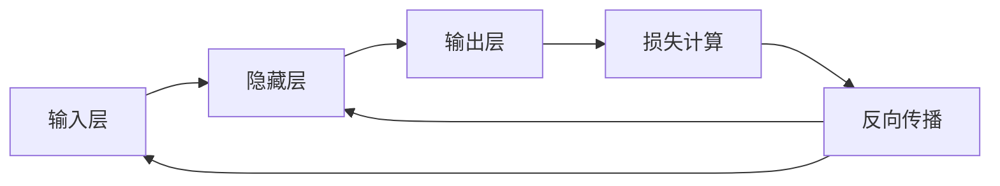

# PyTorch 深度学习完全指南

## 目录
- [PyTorch核心API](#pytorch核心api)
- [深度学习基础概念](#深度学习基础概念)
- [常见模型架构](#常见模型架构)
- [实践建议](#实践建议)
- [实际应用场景](#实际应用场景)
- [性能优化指南](#性能优化指南)

## PyTorch核心API

### 1. 张量操作 (Tensor Operations)
```python
# 创建张量
torch.tensor()     # 从数据创建张量
torch.zeros()      # 创建全0张量
torch.ones()       # 创建全1张量
torch.randn()      # 创建随机正态分布张量
```

主要操作：
- `view()/reshape()`: 改变张量形状
- `squeeze()/unsqueeze()`: 压缩/扩展维度
- `cat()/stack()`: 张量拼接
- `mean()/sum()`: 统计运算

### 2. 自动求导 (Autograd)
```python
x = torch.tensor([1.0], requires_grad=True)
y = x * 2
y.backward()  # 自动计算梯度
x.grad        # 获取梯度值
```

关键概念：
- `requires_grad`: 标记需要计算梯度的张量
- `backward()`: 反向传播计算梯度
- `grad`: 存储梯度值
- `no_grad()`: 临时关闭梯度计算

### 3. 神经网络模块 (nn.Module)
```python
class Net(nn.Module):
    def __init__(self):
        super().__init__()
        self.fc1 = nn.Linear(784, 128)
        self.fc2 = nn.Linear(128, 10)
    
    def forward(self, x):
        x = F.relu(self.fc1(x))
        return self.fc2(x)
```

常用层：
- `nn.Linear`: 全连接层
- `nn.Conv2d`: 2D卷积层
- `nn.RNN/LSTM/GRU`: 循环神经网络层
- `nn.BatchNorm2d`: 批量归一化
- `nn.Dropout`: Dropout正则化

### 4. 优化器 (Optimizers)
```python
optimizer = optim.SGD(model.parameters(), lr=0.01)
optimizer.zero_grad()  # 清零梯度
loss.backward()        # 反向传播
optimizer.step()       # 更新参数
```

常用优化器：
- `optim.SGD`: 随机梯度下降
- `optim.Adam`: 自适应矩估计
- `optim.RMSprop`: 均方根传播
- `optim.AdamW`: 带权重衰减的Adam

## 深度学习基础概念

### 1. 前向传播与反向传播



- **前向传播**：数据从输入层经过网络层层传递到输出层的过程
- **反向传播**：从输出层计算损失，然后逐层计算梯度并更新参数的过程

### 2. 损失函数
常见损失函数及其应用场景：

- **均方误差(MSE)**：回归问题
  ```python
  criterion = nn.MSELoss()
  ```

- **交叉熵(Cross Entropy)**：分类问题
  ```python
  criterion = nn.CrossEntropyLoss()
  ```

- **二元交叉熵**：二分类问题
  ```python
  criterion = nn.BCELoss()
  ```

### 3. 激活函数


常用激活函数：
- **ReLU**: 最常用的激活函数，解决梯度消失问题
- **Sigmoid**: 二分类问题的输出层
- **Tanh**: 在循环神经网络中常用
- **LeakyReLU**: 解决"死亡ReLU"问题

### 4. 批量归一化 (Batch Normalization)


作用：
- 加速训练收敛
- 提高模型稳定性
- 减轻过拟合

## 常见模型架构

### 1. 卷积神经网络 (CNN)


主要组件：
- 卷积层：提取特征
- 池化层：降维、提取主要特征
- 全连接层：分类或回归

### 2. 循环神经网络 (RNN)


变体：
- LSTM：长短期记忆网络
- GRU：门控循环单元
- Bi-directional RNN：双向循环神经网络

## 实际应用场景

### 1. 计算机视觉
```python
# 图像分类模型
class ImageClassifier(nn.Module):
    def __init__(self):
        super().__init__()
        self.features = nn.Sequential(
            nn.Conv2d(3, 64, 3),
            nn.ReLU(),
            nn.MaxPool2d(2),
            nn.Conv2d(64, 128, 3),
            nn.ReLU(),
            nn.MaxPool2d(2)
        )
        self.classifier = nn.Linear(128 * 6 * 6, 10)
    
    def forward(self, x):
        x = self.features(x)
        x = x.view(x.size(0), -1)
        return self.classifier(x)
```

应用：
- 图像分类
- 目标检测
- 图像分割
- 人脸识别

### 2. 自然语言处理
```python
# 文本分类模型
class TextClassifier(nn.Module):
    def __init__(self, vocab_size, embed_dim, hidden_dim):
        super().__init__()
        self.embedding = nn.Embedding(vocab_size, embed_dim)
        self.lstm = nn.LSTM(embed_dim, hidden_dim, batch_first=True)
        self.fc = nn.Linear(hidden_dim, num_classes)
    
    def forward(self, x):
        x = self.embedding(x)
        lstm_out, _ = self.lstm(x)
        return self.fc(lstm_out[:, -1, :])
```

应用：
- 文本分类
- 情感分析
- 机器翻译
- 问答系统

### 3. 推荐系统
```python
# 协同过滤模型
class CollaborativeFiltering(nn.Module):
    def __init__(self, num_users, num_items, embedding_dim):
        super().__init__()
        self.user_embeddings = nn.Embedding(num_users, embedding_dim)
        self.item_embeddings = nn.Embedding(num_items, embedding_dim)
    
    def forward(self, user_ids, item_ids):
        user_embeds = self.user_embeddings(user_ids)
        item_embeds = self.item_embeddings(item_ids)
        return torch.sum(user_embeds * item_embeds, dim=1)
```

应用：
- 商品推荐
- 内容推荐
- 个性化广告

## 性能优化指南

### 1. 数据加载优化
```python
# 使用多进程数据加载
train_loader = DataLoader(
    dataset,
    batch_size=32,
    num_workers=4,
    pin_memory=True
)
```

### 2. 混合精度训练
```python
# 使用自动混合精度
scaler = torch.cuda.amp.GradScaler()

with torch.cuda.amp.autocast():
    outputs = model(inputs)
    loss = criterion(outputs, targets)

scaler.scale(loss).backward()
scaler.step(optimizer)
scaler.update()
```

### 3. 模型并行化
```python
# 数据并行
model = nn.DataParallel(model)
model = model.to(device)
```

### 4. 内存优化
```python
# 梯度累积
for i, (inputs, labels) in enumerate(train_loader):
    outputs = model(inputs)
    loss = criterion(outputs, labels)
    loss = loss / accumulation_steps
    loss.backward()
    
    if (i + 1) % accumulation_steps == 0:
        optimizer.step()
        optimizer.zero_grad()
```

### 5. 推理优化
```python
# 模型量化
quantized_model = torch.quantization.quantize_dynamic(
    model,
    {nn.Linear, nn.Conv2d},
    dtype=torch.qint8
)
```

## 调试与监控

### 1. 张量检查
```python
def inspect_tensor(x, name="tensor"):
    print(f"{name}:")
    print(f"- Shape: {x.shape}")
    print(f"- Type: {x.dtype}")
    print(f"- Device: {x.device}")
    print(f"- Mean: {x.mean().item():.4f}")
    print(f"- Std: {x.std().item():.4f}")
    print(f"- Min: {x.min().item():.4f}")
    print(f"- Max: {x.max().item():.4f}")
```

### 2. 梯度监控
```python
def monitor_gradients(model):
    for name, param in model.named_parameters():
        if param.grad is not None:
            print(f"{name} gradients:")
            print(f"- Mean: {param.grad.mean():.4f}")
            print(f"- Std: {param.grad.std():.4f}")
```

### 3. 训练过程可视化
```python
from torch.utils.tensorboard import SummaryWriter

writer = SummaryWriter('runs/experiment_1')

# 记录损失
writer.add_scalar('Loss/train', train_loss, epoch)
writer.add_scalar('Loss/validation', val_loss, epoch)

# 记录学习率
writer.add_scalar('Learning rate', scheduler.get_last_lr()[0], epoch)

# 记录梯度直方图
for name, param in model.named_parameters():
    writer.add_histogram(name, param.data, epoch)
```

## 最佳实践总结

1. 数据预处理
   - 标准化/归一化
   - 数据增强
   - 处理缺失值
   - 处理不平衡数据

2. 模型设计
   - 从简单模型开始
   - 逐步增加复杂度
   - 使用残差连接
   - 适当的正则化

3. 训练策略
   - 使用学习率调度
   - 实施早停
   - 保存检查点
   - 使用交叉验证

4. 部署考虑
   - 模型压缩
   - 推理优化
   - 错误处理
   - 监控指标

记住：深度学习是实验科学，需要大量实践和调试。保持耐心，善于观察，勤于总结，就能不断提高。
